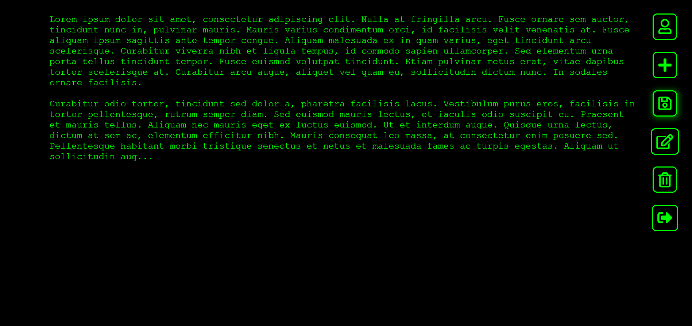
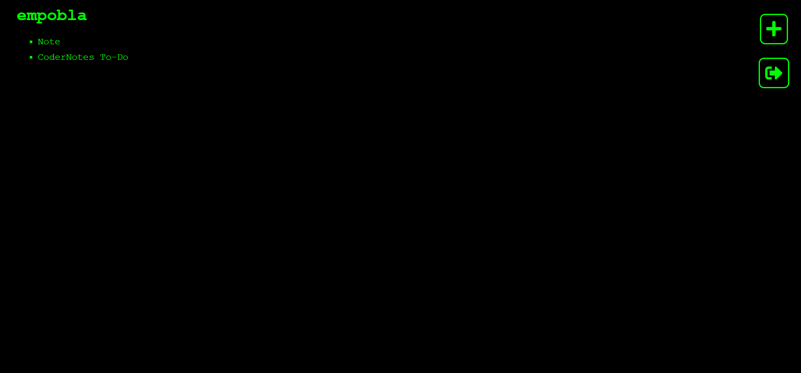

<!-- Improved compatibility of back to top link: See: https://github.com/othneildrew/Best-README-Template/pull/73 -->
<a name="readme-top"></a>
<!--
*** Thanks for checking out the Best-README-Template. If you have a suggestion
*** that would make this better, please fork the repo and create a pull request
*** or simply open an issue with the tag "enhancement".
*** Don't forget to give the project a star!
*** Thanks again! Now go create something AMAZING! :D
-->


<!-- PROJECT SHIELDS -->
<!--
*** I'm using markdown "reference style" links for readability.
*** Reference links are enclosed in brackets [ ] instead of parentheses ( ).
*** See the bottom of this document for the declaration of the reference variables
*** for contributors-url, forks-url, etc. This is an optional, concise syntax you may use.
*** https://www.markdownguide.org/basic-syntax/#reference-style-links
-->
[![MIT License][license-shield]][license-url]
[![LinkedIn][linkedin-shield]][linkedin-url]


<!-- PROJECT LOGO -->
<br />
<div align="center">
  <a href="https://github.com/empobla/CoderNotes">
    <p style="font: 50px monospace; margin: 0; color: #0f0;">Coder Notes</p>
  </a>

<h3 align="center">Coder Notes</h3>

  <p align="center">
    Coder Notes is a website which allows you to take notes online and save them.
    <br />
    <br />
    <a href="https://github.com/empobla/CoderNotes/issues">Report Bug</a>
    ·
    <a href="https://github.com/empobla/CoderNotes/issues">Request Feature</a>
  </p>
</div>


<!-- TABLE OF CONTENTS -->
<details>
  <summary>Table of Contents</summary>
  <ol>
    <li>
      <a href="#about-the-project">About The Project</a>
      <ul>
        <li><a href="#built-with">Built With</a></li>
      </ul>
    </li>
    <li>
      <a href="#getting-started">Getting Started</a>
      <ul>
        <li><a href="#prerequisites">Prerequisites</a></li>
        <li><a href="#installation">Installation</a></li>
      </ul>
    </li>
    <li><a href="#usage">Usage</a></li>
    <li><a href="#contributing">Contributing</a></li>
    <li><a href="#license">License</a></li>
    <li><a href="#contact">Contact</a></li>
  </ol>
</details>


<!-- ABOUT THE PROJECT -->
## About The Project

![Coder Notes Screen Shot][product-screenshot]

Coder Notes is a website which allows you to quickly take notes online and save them, having access to the notes quickly anywhere in the world.

<p align="right">(<a href="#readme-top">back to top</a>)</p>


### Built With

[![MongoDB][MongoDB]][Mongo-url]
[![Express][Express.js]][Express-url]
[![Pug][Pug.js]][Pug-url]
[![Node][Node.js]][Node-url]
[![Heroku][Heroku]][Heroku-url]

<p align="right">(<a href="#readme-top">back to top</a>)</p>


<!-- GETTING STARTED -->
## Getting Started

To get a local copy up and running follow these simple example steps.

### Prerequisites

This project requires Node.js and local MongoDB. A MongoDB server must be set up locally before using this project.
* Install npm:
  ```sh
  npm install npm@latest -g
  ```
* Install [MongoDB Community Server][MongoDB-community-url]. Instructions for MongoDB Community Server can be found [here][MongoDB-instructions-url].

### Installation

1. Clone the repo
   ```sh
   git clone https://github.com/empobla/CoderNotes.git
   ```
2. Install NPM packages
   ```sh
   npm install
   ```
3. Start the server in development mode!
   ```sh
   npm run devstart
   ```

<p align="right">(<a href="#readme-top">back to top</a>)</p>


<!-- USAGE EXAMPLES -->
## Usage

To write a note, simply start writing! 



You can also view your notes, edit existing ones, create new notes, and even delete your notes!



<p align="right">(<a href="#readme-top">back to top</a>)</p>


<!-- CONTRIBUTING -->
## Contributing

Contributions are what make the open source community such an amazing place to learn, inspire, and create. Any contributions you make are **greatly appreciated**.

If you have a suggestion that would make this better, please fork the repo and create a pull request. You can also simply open an issue with the tag "enhancement".
Don't forget to give the project a star! Thanks again!

1. Fork the Project
2. Create your Feature Branch (`git checkout -b feature/AmazingFeature`)
3. Commit your Changes (`git commit -m 'Add some AmazingFeature'`)
4. Push to the Branch (`git push origin feature/AmazingFeature`)
5. Open a Pull Request

<p align="right">(<a href="#readme-top">back to top</a>)</p>


<!-- LICENSE -->
## License

Distributed under the MIT License. See `LICENSE.txt` for more information.

<p align="right">(<a href="#readme-top">back to top</a>)</p>


<!-- CONTACT -->
## Contact

Emilio Popovits Blake - [Contact](https://emilioppv.com/contact)

Project Link: [https://github.com/empobla/CoderNotes](https://github.com/empobla/CoderNotes)

<p align="right">(<a href="#readme-top">back to top</a>)</p>


<!-- MARKDOWN LINKS & IMAGES -->
<!-- https://www.markdownguide.org/basic-syntax/#reference-style-links -->
[license-shield]: https://img.shields.io/github/license/empobla/CoderNotes?style=for-the-badge
[license-url]: https://github.com/empobla/CoderNotes/blob/master/LICENSE.txt
[linkedin-shield]: https://img.shields.io/badge/-LinkedIn-black.svg?style=for-the-badge&logo=linkedin&colorB=555
[linkedin-url]: https://linkedin.com/in/emilio-popovits

[product-screenshot]: README/images/main.png

[MongoDB]: https://img.shields.io/badge/mongodb-ffffff?style=for-the-badge&logo=mongodb&logoColor=47a248
[Mongo-url]: https://www.mongodb.com/
[Express.js]: https://img.shields.io/badge/express-000000?style=for-the-badge&logo=express&logoColor=ffffff
[Express-url]: https://expressjs.com/
[Pug.js]: https://img.shields.io/badge/pug.js-a86454?style=for-the-badge&logo=pug&logoColor=000000
[Pug-url]: https://pugjs.org
[Node.js]: https://img.shields.io/badge/node.js-090c15?style=for-the-badge&logo=nodedotjs&logoColor=339933
[Node-url]: https://nodejs.org
[Heroku]: https://img.shields.io/badge/heroku-430098?style=for-the-badge&logo=heroku&logoColor=ffffff
[Heroku-url]: https://www.heroku.com/

[MongoDB-community-url]: https://www.mongodb.com/try/download/community
[MongoDB-atlas-url]: https://www.mongodb.com/atlas/database
[MongoDB-instructions-url]: https://www.mongodb.com/docs/manual/administration/install-community
[IAM-instructions-url]: https://docs.aws.amazon.com/IAM/latest/UserGuide/id_users_create.html